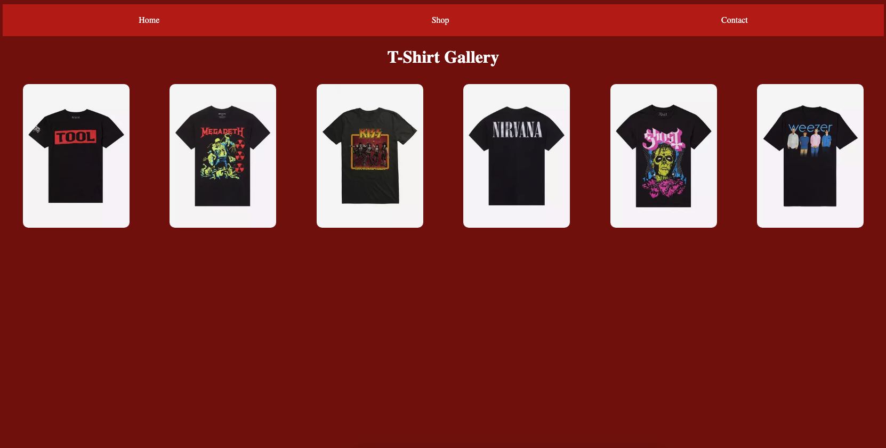
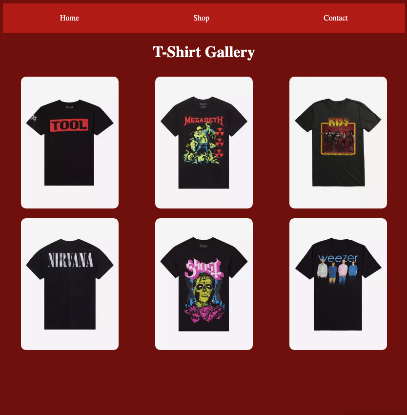
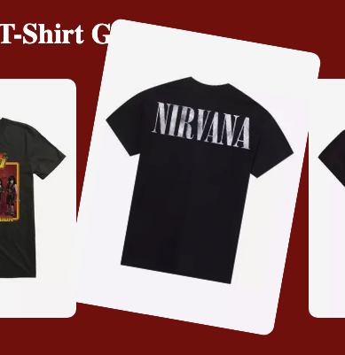

# css-transition

## Learning Target
- I am reviewing box model properties, flex containers, and hover selectors 
- I am learning how to use the CSS transition and transform properties to automatically animate between two states

## Success Criteria
- I can set initial and :hover or :active properties for an element in CSS (colors, border, position, etc.)
- I can use the transition property to animate the transition to the hovered state
- I can use the transform property to scale, rotate, or translate an element


## Get started
1. Install Live Server and Go Live to view how the webpage looks with no styling
2. Follow directions below

## Basic Page Styles
Use **box model** and **flex** properties to style the page so it looks like the screenshots below.
1. Follow along with my example for the nav
2. You complete the gallery

### Box Model Properties
```css
selector {
    width: 50%;
    height: auto;
    padding: 20px;
    border: 2px solid red;
    margin: 20px;
}
```

### Flex Container Properties
```css
container {
    display: flex;
    flex-direction: row | column;
    justify-content: start | end | center | space-around | space-between | space-evenly;
    align-items: start | end | center | stretch;
    flex-wrap: wrap | nowrap;
}
```

### Wide screen


### Narrow screen


## Transitions
```css
selector {
    transition: property duration timing-function;
}

a {
    transition: background-color 1s ease;
}
```
## Transform property
```css
selector {
    transform: translate(x, y) | scale(%) | rotate(deg);
}
```
1. Follow my example to add a transition for the a tags in the header to change background color and move up.  

2. Follow my example to add transistions for the gallery images to zoom-in and rotate.  
